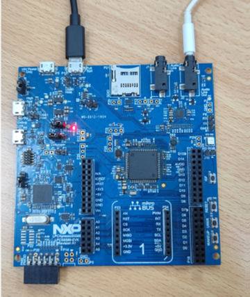
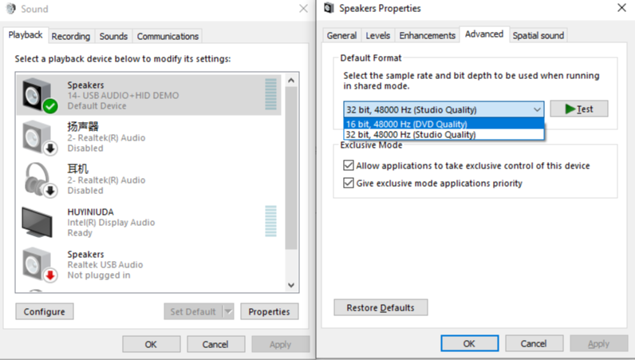

# NXP Application Code Hub

## AN13447: How to implement Multiple USB Audio Formats on LPC5500
This application note will show you how to implement multiple USB audio formats on the LPC5500 series. Please refer to [AN13447](https://www.nxp.com/docs/en/application-note/AN13447.pdf) for detailed information. For MCUs with USB device controllers, the NXP SDK (Software Development Kit) generally provides a USB audio example. This example only supports a single audio format. For example, LPC55S69- EVK, this board has a WM8904 codec. A USB audio example (usb_device_composite_hid_audio_unified_bm) is also provided in the SDK. Now, this example supports the 48 K/16 bit audio format. However, in the actual application of the customer, it is sometimes necessary to support multiple audio formats. This application note takes LPC55S69 as an example to describe how to make the USB audio speaker support 48 K/16 bit and 48 K/32 bit audio formats based on the USB audio example of LPC55S69 SDK v2.10.

#### Boards: LPCXpresso55S69
#### Categories: Audio
#### Peripherals: DMA, I2S, USB
#### Toolchains: MDK

## Table of Contents
1. [Software](#Step1)
2. [Hardware](#step2)
3. [Setup](#step3)
4. [Result]()
5. [FAQs]()
6. [Support](#step4)
7. [Release Notes](#step5)

## 1. Software

- SDK: 2.10.0
- MDK: 5.37.0
- Any music player that can run on a PC

## 2. Hardware

- [LPCXpresso55S69 EVK board Revision A2 ](https://www.nxp.com/design/software/development-software/mcuxpresso-software-and-tools-/lpcxpresso-boards/lpcxpresso55s69-development-board:LPC55S69-EVK)
- One micro USB cable
- One 3.5mm earphone

## 3. Setup

### 3.1 Step 1
Open MDK project "lpc55s69_dev_composite_hid_audio_unified_bm_audio_format_switch.uvprojx" and compile it, then download the image into the LPCXpresso55S69 EVK board.

### 3.2 Step 2

Connect the full-speed USB connector P10 with the PC via a micro USB cable. Then press the RESET button S4 to run the program.

## 4. Result

The PC will recognize a USB audio device that supports two audio formats: 48K/16bit and 48K/32bit.  

## 5. FAQs

## 6. Support
#### Project Metadata

  

Questions regarding the content/correctness of this example can be entered as Issues within this GitHub repository.

>**Warning**: For more general technical questions regarding NXP Microcontrollers and the difference in expected functionality, enter your questions on the [NXP Community Forum](https://community.nxp.com/)

## 7. Release Notes
| Version | Description / Update                           | Date                        |
|:-------:|------------------------------------------------|----------------------------:|
| 1.0     | Initial release on Application Code HUb        | June 5th 2023 |

